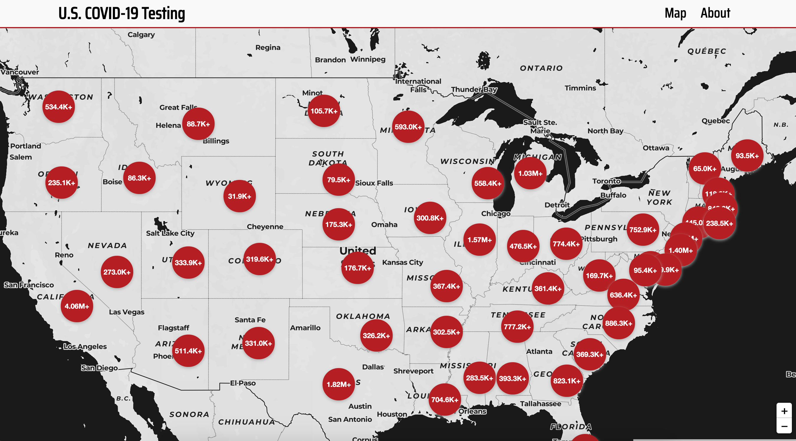
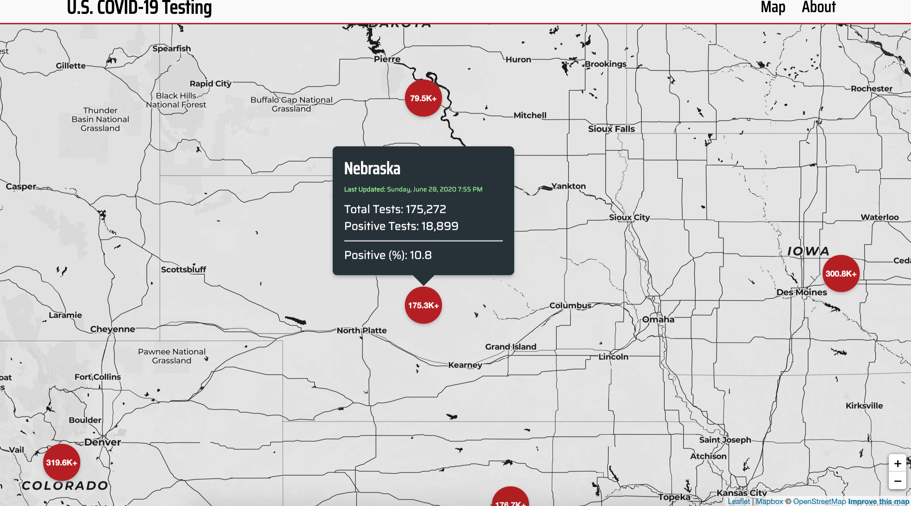

# U.S. Covid Testing Map

> A mapping web app to track COVID-19 testing across U.S. states and territories. 

### About 
This mapping project uses public data from the The Covid Tracking Project's API, a volunteer-driven effort to collect the latest testing figures across all U.S. states and territories, led by The Atlantic. All data is current and comes from the current state data endpoint, which is updated at least once daily between 4PM and 5PM EDT by The Covid Tracking Project team.

You may access the deployed version [here](https://usa-covid-testing.netlify.app/). 

### Demo





### Running locally 
To run locally, clone the repo and run the following in your terminal: 
```
npm install 
```
and then: 
```
npm install 
```

### Sources and Attribution 

* [The COVID Tracking Project](https://yarnpkg.com/en/)
* [Google Maps](https://developers.google.com/maps/documentation)
* [Sass](https://sass-lang.com)
* [Gatsby](https://www.gatsbyjs.org/)
* [Leaflet](https://leafletjs.com/)
* [Gatsby Leaflet Starter](https://github.com/colbyfayock/gatsby-starter-leaflet)
* [Yarn](https://yarnpkg.com/en/)
* [Google Fonts](https://fonts.google.com/)

### Author
**Tomas Gear:** [Github](https://github.com/nexio-t) | [Portfolio](http://www.tomas-gear.com)

